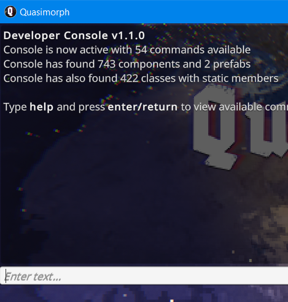

# Quasimorph Enable Debug Console

## Preface
The game is actively changing so this mod may break.
This is a temporary mod as the game will support Steam Workshop in a future update.


# Info
This mod enables the developer console in the game.
Press the tilde key (`) to open the console.



# Installation

## BepInEx

If BepInEx 5 has been previously installed, skip to the [Mod Install](#mod-install) section.

1. Download the BepInEx utility from https://github.com/BepInEx/BepInEx/releases/download/v5.4.23.2/BepInEx_win_x64_5.4.23.2.zip
2. Extract the contents of the zip file into the game's directory, ```<steam directory>\steamapps\common\Quasimorph``` .
    - There will now be a ``BepInEx`` directory.
3. Run the game and exit once the main screen is shown.  This is required to setup BepInEx.
4. If BepInEx ran correctly, there should now be BepInEx\plugins directory in the game's directory.

## Mod Install
1. Download the QM-EnableConsole.zip file from https://github.com/NBKRedSpy/QM-EnableConsole/releases
2. Extract the zip file into the BepInEx\plugins directory.
3. Run the game.


# Installation Issues.

If the mod is not working and this is the first time BepInEx was installed, 99% of the time the files were copied to the wrong directory.

After the mod is installed, the game's directory must have the directories and files listed below.  Otherwise, redo the install process.

```
Quasimorph
|
│   Quasimorph.exe
│   winhttp.dll
│   
├───BepInEx
│   └───plugins
│       └───QM-EnableConsole
│               QM-EnableConsole.dll
│               
└───Quasimorph_Data
```


# Source Code
Source code is available on GitHub https://github.com/NBKRedSpy/QM-EnableConsole
